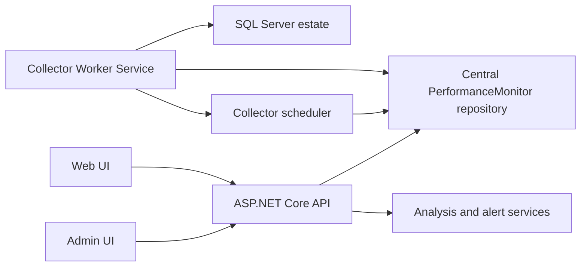

# Agentless Web Platform Direction

## Product Shape

Run Performance Monitor as a central service for a SQL Server estate:

- install one collector/web host on an application server
- register many SQL Server instances to monitor
- connect remotely with least-privilege SQL credentials
- collect DMV, Query Store, Extended Events, configuration, capacity, and job telemetry
- store estate-wide history centrally
- serve the data through a web API and browser UI

The monitored SQL Servers should not require SQL Agent jobs for Performance Monitor collection. They may still expose SQL Agent metadata for the running-jobs collector where permissions allow it.

## Why This Fits The Existing Code

The repository already contains both halves of this design:

- Full Edition has a rich SQL schema, retention logic, reporting views, alerting, analysis, and dashboard query surface.
- Lite Edition already proves agentless remote collection from a desktop process into local DuckDB.

The web platform should reuse those strengths rather than starting over:

- reuse Lite's remote collector query logic and scheduler behavior
- reuse Dashboard's analysis, alerting, MCP, plan parsing, and reporting concepts
- keep the install scripts for creating a central repository database
- replace per-target SQL Agent scheduling with a service-hosted scheduler

## Target Architecture

### Collector Worker

The collector worker runs on the monitoring server, not on every SQL Server. It owns:

- server inventory
- connection credentials
- per-server schedule state
- collection leases so only one worker collects a given server/collector at a time
- retry/backoff for unreachable servers
- permission gating when a collector is not allowed on a target
- retention jobs that run centrally

The first implementation should be a .NET Worker Service because the repo is already .NET 8 and the collector code is C#.

### Central Repository

Use a central SQL Server database first, because the Full Edition already assumes the `PerformanceMonitor` schema and the Dashboard reads that shape today.

Needed changes:

- add an estate dimension to collection tables, likely `server_id`
- add inventory/config tables for monitored instances
- keep collector logs per server and collector
- run retention centrally without SQL Agent
- preserve view names where possible so existing Dashboard query logic can be ported gradually

DuckDB remains useful for Lite, local demos, or an embedded mode, but the estate server should default to SQL Server storage.

### Web API

The API should expose stable endpoints over the central repository:

- server inventory and health summary
- time-series resource data
- query performance drilldowns
- wait, blocking, deadlock, memory, tempdb, file I/O, and capacity views
- alert history and mute rules
- analysis findings
- collection health and last-run status

Dashboard's existing `DatabaseService.*` query methods are the best starting point for API handlers, but they should move behind service interfaces so WPF and web can share query semantics while the web UI gets HTTP-friendly DTOs.

### Web UI

The first website should be an operational console, not a marketing surface:

- estate overview with health cards and recent changes
- server detail page with tabs for workload, waits, resources, memory, locking, system events, and capacity
- query detail pages with plan viewing and history
- collector health page showing stale/erroring collectors
- admin area for servers, credentials, schedules, alerting, and retention

The UI should be dense, searchable, and comparative. This is a dev-estate command center, so the priority is scanability and fast drilldown.

## Permission Model

The monitored servers should only need read-style permissions:

- `VIEW SERVER STATE` or `VIEW SERVER PERFORMANCE STATE` where available
- `VIEW ANY DATABASE` if database inventory is required
- Query Store read access per database where query store views are collected
- `msdb` read roles only if job monitoring is enabled
- optional permissions for Extended Events and external community procedures

The service account owns collection scheduling and storage writes only in the central repository.

## Migration Phases

1. Extract shared collector contracts.
   Move collector names, schedule definitions, server models, health state, and result DTOs into shared non-WPF projects.

2. Create a central repository model.
   Add server identity to collection storage and create central inventory/configuration tables.

3. Build the headless collector worker.
   Port the Lite remote collector loop to a .NET Worker Service that writes to the central repository.

4. Add API endpoints over existing dashboard queries.
   Start with overview, waits, CPU, memory, query stats, blocking, and collector health.

5. Build the first web console.
   Use the API to serve an estate overview and server detail pages.

6. De-emphasize SQL Agent installation.
   Make SQL Agent jobs optional/legacy for Full Edition, with the agentless service as the preferred deployment.

## First Thin Slice

The safest first build target is:

- create `PerformanceMonitor.Collector.Service`
- create `PerformanceMonitor.Shared`
- copy the Lite schedule model and remote collector dispatcher behind shared interfaces
- implement one collector end-to-end against the central repository, starting with server properties or wait stats
- expose collector health through a minimal API endpoint

That proves the hardest architectural question without needing to port the whole dashboard at once.
